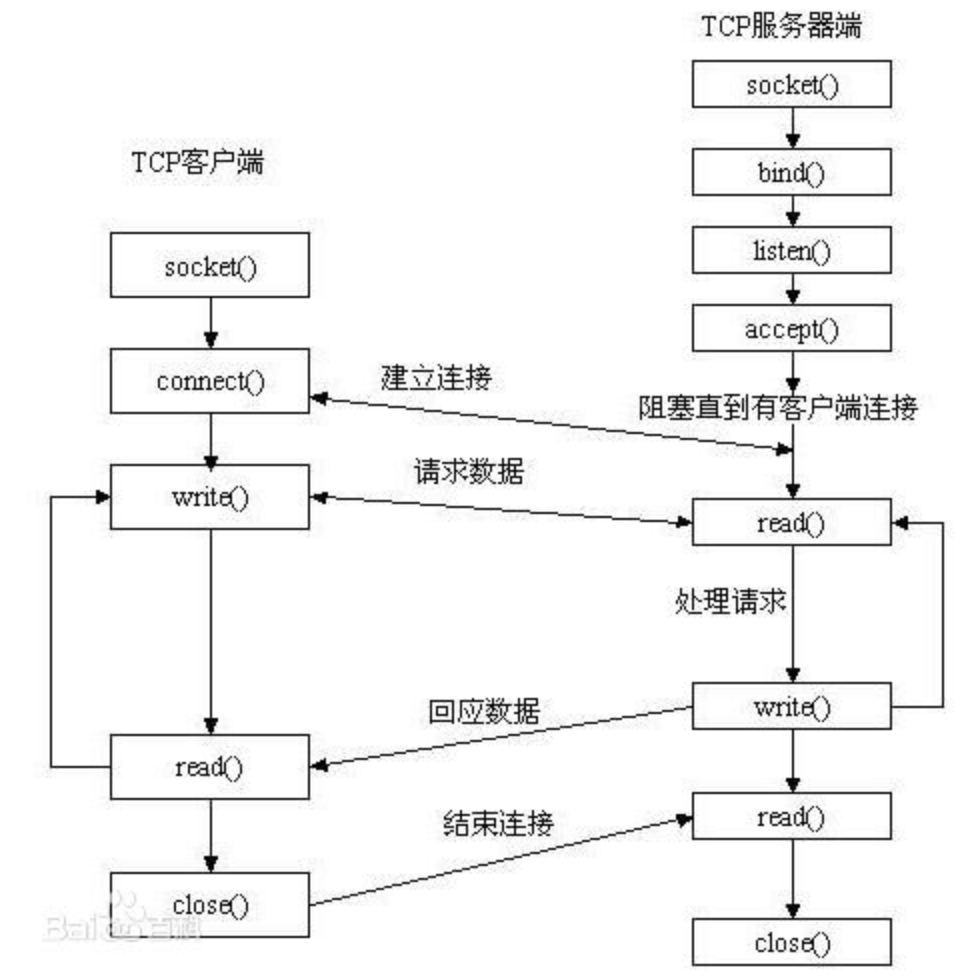

#Socket相关知识
##理论
###http socket tcp 关系
- http 应用层
- socket 介于传输层与应用层中间，基于TCP、UDP等封装的API，实现数据在IP网络的传播
- TCP/UDP 传输层
- socket是一组编程API，HTTP/TCP是协议

##training

### TCP 连接的建立步骤
####服务端 TCPServerSocket
- 创建一个 ServerSocket 实例并指定本地端口，用来监听客户端在该端口发送的 TCP 连接请求；
- 调用 ServerSocket 的 accept（）方法以获取客户端连接，并通过其返回值创建一个 Socket 实例；
- 为返回的 Socket 实例开启新的线程，并使用返回的 Socket 实例的 I/O 流与客户端通信
- 使用 Socket 类的 close（）方法关闭该客户端的套接字连接
####客户端 TCPSocket
- 创建一个 Socket 实例：构造函数向指定的远程主机和端口建立一个 TCP 连接；
- 通过套接字的 I/O 流与服务端通信；
- 使用 Socket 类的 close 方法关闭连接。

### udp 编程示例